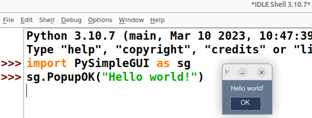

# dice game

## lesson goal: 
  * problem solving: adapting a physical dice game to a computer game using python. 
    * reading game rules from wikipedia
    * adapting game rules to python code
  * (prototyping: creating a prototype with a very simple text interface)
  * gui-programming: making a GUI (Graphical User Interface) using PySimpleGUI
    * introduction into working with PySimpleGUI
    * introduction into using the PySimpleGUI documentation
  * working with unicode characters (dice faces) for prototype and gui
  * testing

## requirement
  * understanding how to use `f-strings` to display variables (numbers) inside of a text string https://docs.python.org/3/reference/lexical_analysis.html#formatted-string-literals
  * understanding the `escape sequence` for new line (\n) inside of a text string
  * working with `while` loops and the `break` and `continue` statements 
  * working with if statement
  
## recommended  
  * understanding what a list and a nested list is (a list inside a list)
  * understanding what a tuple is
  * working with dictionaries 
  * understanding how to write unicode characters
  * understanding how the _not_ operator works with boolean values (_True_ and _False_)
  
## terms

  **GUI**: Graphical User Interface. If you communicate with the computer using a mouse to click on buttons, instead of just typing text, you are using a GUI.
  
  **Widget**: The elements inside a gui. For example buttons, sliders, fields to enter a password etc.

  **IDLE**: Interactive Development Learnint Enviroment. A python code editor and also a Python REPL

  **REPL**: Rapid Evaluation Print Loop. To test out short line(s) of python code directly. 

  **Boolean values**: A value that can either be **True** or **False**  

## preparation

  * install Python: see https://python.org
  * install PySimpleGUI: see https://pysimplegui.org
    * understand PySimpleGUI template program: https://www.pysimplegui.org/en/latest/#jump-start
    * understand PySimpleGUI color themes and theme preview: https://www.pysimplegui.org/en/latest/#themes-automatic-coloring-of-your-windows
  * props: prepare 5 dice, read game rules and play games of "yacht" and "yathzee": 
    * yacht: https://en.wikipedia.org/wiki/Yacht_(dice_game)
    * yahtzee: https://en.wikipedia.org/wiki/Yahtzee
  * unicode tables: know unicodes for dice faces: https://en.wikipedia.org/wiki/Miscellaneous_Symbols
  * random module: understand the `random.randint()` command, see https://docs.python.org/3.10/library/random.html?highlight=random#random.randint


### test if PySimpleGUI is correctly installed and working

Use IDLE or any python editor to execute those 2 lines of python code:
```python
import PySimpleGUI as sg
sg.PopupOK("Hello world!")
```

If PySimpleGUI was installed correctly you should see a little GUI-Window with an "Hello world!" Button:




# dicegame: paper version 


_image rights: photo by Lino Wirag, license: creative-commons CC BY-SA 4.0 <https://creativecommons.org/licenses/by-sa/4.0> via Wikimedia Commons_

The (non-computer) version of Yathzee and similar dice games (Yacht, ...) is played with 5 dice and pen and paper. On the paper, a table with 13 lines is made, each line representing an option that the player can play. Those options are similar to the figures of the card game [poker](https://en.wikipedia.org/wiki/Poker) and have names like "full house", "three of a kind" or "Yathzee". For a detailed list of options, see the paragraph about rules below.


# dicegame: the rules of Yathzee

This tutorial simulates the dice game variant "[Yathzee](https://en.wikipedia.org/wiki/Yahtzee)" but several variants of this game with slightly different rules exist, like [Poker Dice](https://en.wikipedia.org/wiki/Poker_Dice), [Yacht](https://en.wikipedia.org/wiki/Yacht_(dice_game)), [Generala](https://en.wikipedia.org/wiki/Generala) etc.

According to  the wikipedia article https://en.wikipedia.org/wiki/Yahtzee the rules of the Yathzee dice game can be summarised as:

* Each player had 5 dice and can throw them 3 times per game round.
* The game has 13 game rounds.
* After the first and the second throw the player can decide to throw some, all or none of his dice again or leave them.
* After the third throw the player must decide one of the 13 possible options. If the dice match with the option, the player gets points for this round, otherwise he get zero points. In both cases, the option is "used up" for the rest of the game.
* The options consist of a upper section (1,2,3,4,5,6) and a lower section ("three of a kind", "four of a kind", "full house", "small straight", "large straight", "yahtzee", "chance"). The scores of each options are:
  * upper section:
    * Aces: the sum of dice with the number one
    * Twos: the sum of dice with the number two
    * Threes: the sum of dice with the number three
    * Fours: the sum of dice with the number four
    * Fives: the sum of dice with the number five
    * Sixes: the sum of dice with the number six. 
    
    Example: the player throws 2 sixes and 3 other numbers. He decide to play the Sixes option. His score is 2 x 6 = 12 points.
  * lower section:
    * three of a kind: Sum of all dice. 0 points if less then 3 dice show the same number.
    * four of a kind: Sum of all dice. 0 points if less then 4 dice show the same number.
    * full house: 25 points. 0 points if there are no 3 dice with the same number and 2 dice with (another) same number.
    * small straight: 30 points if 4 dice show the combination 1,2,3,4 or 2,3,4,5 or 3,4,5,6. Otherwise 0 points.
    * large straight: 40 points if 5 dice show the combination 1,2,3,4,5 or 2,3,4,5,6. Otherwise 0 points.
    * Yahtzee: 50 points if 5 dice show the same number, otherwise 0 points.
    * Chance: sum of all dice
* special rules:
  * Yathzee bonus: If the player throws a Yahtzee and has already filled the Yahtzee box with a score of 50, he score a Yahtzee bonus and get an extra 100 points. However, if he throw a Yahtzee and has used the Yahtzee category already with a score of 0, he does not get a Yahtzee bonus.
  * Joker: A yahtzee can act as full house, small street or large street if the upper section with the dice number has already been used and the Yahtzee option in the lower section has also been used.
  * upper section bonus: If a player scores more than 63 points in the upper section, he gets an bonus of 35 points.


_next chapter: [chapter_02](chapter_02.md)_


