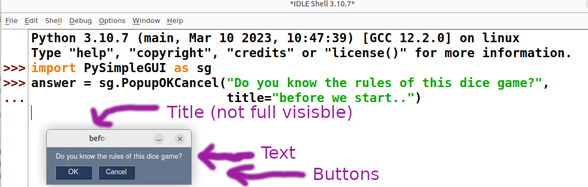
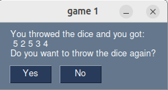
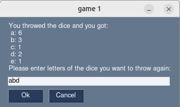
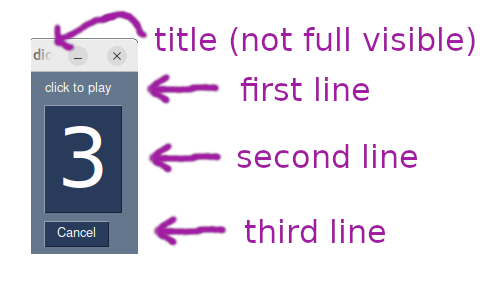
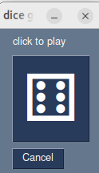
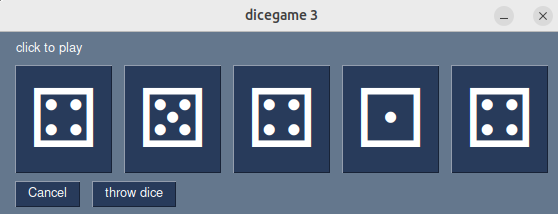
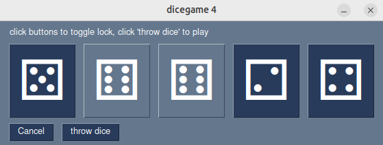
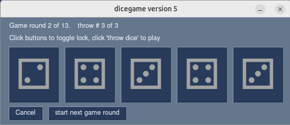

# first steps with PySimpleGUI

PySimpleGUI programs usually follow a certain pattern, described in the [jump start](https://www.pysimplegui.org/en/latest/#jump-start) section of the official PySimpleGUI documentation.


## popups

It is however not necessary to follow this pattern in all cases; PySimpleGUI can also be used to write very primitive [procedural code](https://en.wikipedia.org/wiki/Procedural_programming), using PySimpleGUI's [Popup](https://www.pysimplegui.org/en/latest/#high-level-api-calls-popups) commands. Those popup commands display typically a little [modal window](https://en.wikipedia.org/wiki/Modal_window) (or dialog) with one or more [buttons](https://en.wikipedia.org/wiki/Button_(computing)).




In the screenshot above a popup is created in IDLE. 
If the user clicks on the OK button, the value of the variable ```answer``` will be set to "OK". 
If the user clicks on the Cancel button, the value of the variable ```answer``` wil be set to "Cancel".

Only the parameters for text and title are used in the example above. For a full list of possible parameters (for example, to display an image or control the color of the buttons) see the Call reference in the PySimpleGUI documentation: https://www.pysimplegui.org/en/latest/call%20reference/#popups-pep8-versions


 If the user click one of those buttons, the popup disappears. By chaining several of PySimpleGUI's popup commands in a python program it is possible to create a kind of graphical user interface. A very flickering one, because the popup windows always closes before the next one appears, but sufficient for a first start.

Let's write a PySimpleGUI program using popup functions that displays 5 random numbers (dice throw) and ask the user if he want to throw all five dice again:

download: [dicegame0.py](dicegame0.py)
```python
import PySimpleGUI as sg
import random

game_round = 0
while True:
    game_round += 1
    d1 = random.randint(1,6)
    d2 = random.randint(1,6)
    d3 = random.randint(1,6)
    d4 = random.randint(1,6)
    d5 = random.randint(1,6)
    
    text = "You throwed the dice and you got:\n"
    text +=f"{d1} {d2} {d3} {d4} {d5}\n" 
    
    if d1 == d2 == d3 == d4 == d5:
        text += "You throwed Yathzee!\n"
    text += "Do you want to throw the dice again?"
    answer = sg.PopupYesNo(text, title= f"game {game_round}")
    if answer == "No":
        break
sg.PopupOK("thanks for playing")  
```

output:



This program is easy enough to play, but rather boring. The only excitement is provided by the chance to directly roll a "Yathzee" (with five dices showing the same numer) in one throw. The program can recognize a Yathzee and would display a different message. The chance for this to happen is rather low: 6 * (1/6)<sup>5</sup> or 1 / 1296 or ~0.077%. So...  if you click the "yes" button 1300 times you should see a Yatzee message at least once...on average. Happy testing!

# problem solving

The [dicegame0.py](dicegame0.py) above is far away from a fully functional Yathzee simulation. Let's break down what is missing into several smaller tasks:

* The user must throw all 5 dice and can not choose to throw only some dice.
* A game round consist of only one throw of all five dice instead of three seperate throws of some selected dice
* The user can not choose what option to play after a game round 
* There is no score keeping of points
* The game does not end after 13 game rounds


## task: throw only some dice

Instead of solving all points above at once let's concentrate on one single task first: 
 * allowing to user to throw only some dice out of five

One possibility is to give each die a number (or better a letter, because the dice show numbers) and ask the user which combination of dice he wants to throw, using the [popup_get_text()](https://www.pysimplegui.org/en/latest/#popup-input) function of PySimpleGUI.

[dicegame0a.py](dicegame0a.py)
```python
import PySimpleGUI as sg
import random

game_round = 0
d1 = random.randint(1,6)
d2 = random.randint(1,6)
d3 = random.randint(1,6)
d4 = random.randint(1,6)
d5 = random.randint(1,6)

while True:
    game_round += 1
    text = "You throwed the dice and you got:\n"
     text += f" a: {d1}\n b: {d2}\n c: {d3}\n d: {d4}\n e: {d5}\n" 
    if d1 == d2 == d3 == d4 == d5:
        text += "You throwed Yathzee!\n"
    text += "Please enter letters of the dice you want to throw again:"     
    answer = sg.popup_get_text(text, f"game {game_round}")
    answer = answer.lower()
    if "a" in answer:
        d1 = random.randint(1,6)
    if "b" in answer:
        d2 = random.randint(1,6)
    if "c" in answer:
        d3 = random.randint(1,6)
    if "d" in answer:
        d4 = random.randint(1,6)
    if "e" in answer:
        d5 = random.randint(1,6)
    if answer == "quit":
        break
    
sg.PopupOK("thanks for playing")
```



# PySimpleGUI template code

Using PySimpleGUI's popup functions allows for easy programming, but to have full freedom of using Buttons and other widgets, it's a good idea to build upon the [template code](https://www.pysimplegui.org/en/latest/#jump-start) provided in PySimpleGUI's documentation.


download: [dicegame1.py](dicegame1.py)
```python
"""
dicegame1: one button displaying a random number if clicked
"""

import random
import PySimpleGUI as sg

# d1 ... dice number one

layout = [
    [sg.Text("click to play")],
    [sg.Button("?", key="d1", font=("System",64))],
    [sg.Button("Cancel")],
]

window = sg.Window("dice game 1", layout)

while True:
    event, values = window.read()
    if event in ("Cancel", sg.WIN_CLOSED):
        break
    if event == "d1":
        throw = random.randint(1,6)
        window["d1"].update(text=f"{throw}")
window.close()
```

compare the 3 lists of the ```layout``` variable in the code above with those 3 lines of the PySimpleGUI layout:



# understanding PySimpleGUI template code

## layout

PySimpleGUI uses a line layout, meaning all widgets (Buttons, Textfields etc.) are organized in lines.

In Python code, this layout is provided by a list (the variable layout) that contains other lists (the individual lines). The inner lists contain the widgets (Buttons etc.).
In the example above, the variable ```layout``` is a nested list with 3 inner lists. The layout (see screenshot above) has 3 lines: 
1. A label ("click to play")
2. A big button (in the screenshot the button text is "3")
3. A "cancel" button

## window

PySimpleGUI constructs a GUI with the ```sg.Window``` comand:
This command has 2 necessary parameters:
1. The window title (displayed on top of the window)
2. The window layout

In the screenshot above you can see that only the first characters of the window title are visible because the window itself is too small to display the full title.

Please note that the whole ```sg.Window``` object itself is stored inside a variable called ```window```. 

```python
window = sg.Window("window title", layout)
```

## reading the window

The window itself would not work without a ```read()``` command. This is done inside of a ``ẁhile``` loop.

The ```read()``` command returns a tuple: 

```(event, values)```
  * the name of the event (for example, the clicked button)
  * a dictionary of values (for examles, entered text in an input field or the value of a slider widget)

As soon as a button is clicked, an event is created and the event can than be processed by the event handler code inside of the loop: Usually, the event handler code is a big block of ```if event === "button name":``` lines.

## updating the window

Sadly it is not possible to simply modify the ```layout``` variable to make changes of an existing PySimpleGUI window. It is however possible to modify the widgets inside the window using the ```window.update["widget name"](parameter=value)``` command. 

In the example above, the button with the _key_ "d1" is updated to display another text:

```window["d1"].update(text="some new text")```

## close the window
Don't forget that the last line in a PySimpleGUI code shold be ```window.close()```. This line is usually executed after the user clicked on an "Exit" button or manually closed the window by some other method.


## reading PySimpleGUI's documentation

PySimpleGUI's documentation page has a linke called ["Call reference"](https://www.pysimplegui.org/en/latest/call%20reference/#button-element)

This is an excellent resource to learn about all possible parameters for each widget.

# improvement: showing die faces using unicode

Let us further improve the code by showing the result of the die throw as a die face instead of as a number.

download: [dicegame2.py](dicegame2.py)
```python
"""
dicegame2: one button showing a die when clicked
"""

import random
import PySimpleGUI as sg

codes = {1:"\u2680",
         2:"\u2681",
         3:"\u2682",
         4:"\u2683",
         5:"\u2684",
         6:"\u2685",
         }

layout = [
    [sg.Text("click to play")],
    [sg.Button("?", key="d1", font=("System",64), tooltip="click me")],
    [sg.Button("Cancel")],
]

window = sg.Window("dice game 2", layout)

while True:
    event, values = window.read()
    if event in ("Cancel", sg.WIN_CLOSED):
        break
    if event == "d1":
        throw = random.randint(1,6)
        window["d1"].update(text=f"{codes[throw]}")
window.close()
```



Most modern computer fonts can show far more than the letters of the classical alphabet: Many practical symbols (emojis etc.) exist with an unique unicode and can be displayed. 

To display a unicode symbol in python, write inside of a string \u and a 4-digit unicode number or \U and a 8-digit unicode number. The unicode numbers themself are hexadecimal numbers and can contain the digits 0-9 and the letters A-F.

For example, the unicode for a die with one eye (a "one") is "\u2680" 

This fact is used in the dicegame2.py above by creating a ```dictionary``` with the name codes. The _keys_ of this dictionary are the numbers from 1 to 6, the _values_ of this dictionary are the corresponding unicodes showing die faces.

```python
codes = {1:"\u2680",
         2:"\u2681",
         3:"\u2682",
         4:"\u2683",
         5:"\u2684",
         6:"\u2685",
         }
```

Instead of updating the _d1_ Button with the value of the variable _throw_ (a random number between 1 and 6), python performs a lookup operation in the dictionary _codes_ to find out the corresponding unicode for _throw_:

```codes[throw]```

This unicode is then used as the _button text_ for the _d1_ widget:

```window["d1"].update(text=f"{codes[throw]}")```

# improvement: showing five dice in a row

With minimal changes to the layout, the program can be further improved to show 5 buttons in a row. Each button represents a die and  can be clicked to throw this die. 

Additionally, an "throw dice" button is provided to throw all five dice at once:

download: [dicegame3.py](dicegame3.py)

```python
"""
dicegame3: display 5 buttons in a row, showing dice faces
include a "throw all" button
"""

import random
import PySimpleGUI as sg

# unicode for dice faces, see https://en.wikipedia.org/wiki/Miscellaneous_Symbols
codes = {1:"\u2680",
         2:"\u2681",
         3:"\u2682",
         4:"\u2683",
         5:"\u2684",
         6:"\u2685",
         }

layout = [
    [sg.Text("click to play")],
    [sg.Button("?", key="d1", font=("System",64)),
     sg.Button("?", key="d2", font=("System",64)),
     sg.Button("?", key="d3", font=("System",64)),
     sg.Button("?", key="d4", font=("System",64)),
     sg.Button("?", key="d5", font=("System",64)),     
    ],
    [sg.Button("Cancel"), sg.Button("throw dice")],
]

window = sg.Window("dicegame 3", layout)

while True:
    event, values = window.read()
    if event in ("Cancel", sg.WIN_CLOSED):
        break
    if event in ("d1","d2","d3","d4","d5"):
        throw = random.randint(1,6)
        window[event].update(text=f"{codes[throw]}")
    if event == "throw dice":
        for w in ("d1","d2","d3","d4","d5"):
            throw = random.randint(1,6)
            window[w].update(text=f"{codes[throw]}")
window.close()
```


## pattern recognition: avoid duplicate code

If you take a closer look at those lines:
```python
if event in ("d1","d2","d3","d4","d5"):
        throw = random.randint(1,6)
        window[event].update(text=f"{codes[throw]}")
    if event == "throw dice":
        for w in ("d1","d2","d3","d4","d5"):
```
You will notice that the tuple ```("d1","d2","d3","d4","d5")``` appears twice. 

This is a duplicate code and should be avoided when possible. 

Why?

Not because the computer has any problem with duplicate code .... he does not care. The problem is within us humans, the computer programmers. When we ever need to change the code -for example, by introducing a sixth die button with the _key_ `d6` we must do so not in one, but in two places. Chances are very high that we will forget or fail to make this edits at two (or more!) places in exactly the same way. This in turn can lead to code that has errors or erratic behavior that is very hard to track down.

The next version of the dicegame (see below) will avoid the duplicate code:

# improvement: locking some dice

The actual version dicegame3.py allows already to throw only _some_ dice by clicking on them or throw _all_ dice by clicking on a special button. 

A more comfortable user experience would be the ability to click on some buttons to _lock_ them and then throw all _unlocked_ dice by the click of an button.

download: [dicegame4.py](dicegame4.py)

```python
"""
dicegame4: display 5 buttons in a row, showing dice faces
include a "throw dice" button
allows locking/unlocking of each die button 
"""

import random
import PySimpleGUI as sg

color1 = sg.theme_button_color_text()
color2 = sg.theme_button_color_background()
color3 = sg.theme_background_color()

codes = {1:"\u2680",
         2:"\u2681",
         3:"\u2682",
         4:"\u2683",
         5:"\u2684",
         6:"\u2685",
         }

locked = {"d1":False,
          "d2":False,
          "d3":False,
          "d4":False,
          "d5":False}

layout = [
    [sg.Text("click buttons to toggle lock, click 'throw dice' to play")],
    [sg.Button("?", key="d1", font=("System",64)),
     sg.Button("?", key="d2", font=("System",64)),
     sg.Button("?", key="d3", font=("System",64)),
     sg.Button("?", key="d4", font=("System",64)),
     sg.Button("?", key="d5", font=("System",64)),     
    ],
    [sg.Button("Cancel"), sg.Button("throw dice")],
]

window = sg.Window("dicegame 4", layout)

while True:
    event, values = window.read()
    if event in ("Cancel", sg.WIN_CLOSED):
        break
    if event in locked.keys():
        # toggle lock
        locked[event] = not locked[event]
        if locked[event]:
            window[event].update(button_color=(color1,color3) )
        else:
            window[event].update(button_color=(color1,color2) )        
    if event == "throw dice":
        # throw all not-locked dice
        for d in locked.keys():
            if locked[d]:
                continue
            throw = random.randint(1,6)
            window[d].update(text=f"{codes[throw]}")
window.close()
```


### code explained

To display the locked dice buttons in a different color than the unlocked buttons, some variables are created to hold color values:

```python
color1 = sg.theme_button_color_text()
color2 = sg.theme_button_color_background()
color3 = sg.theme_background_color()
```

PySimpleGUI supports different color _themes_ and some functions to get certain colors from the actual color theme. More about themes later.

A new _dictionary_ is created and stored in the variable _locked_. The _keys_ of this dictionary are the same as the _keys_ of the button widgets: ("d1", "d2", ... "d5").

The _values_ of the _locked_ dictionary are `boolean` values and at the beginning of the program they are all set to `False`.

The event handler toggles the value in the _locked_ dictionary if one of the five buttons is clicked: 
  * not `True` becomes `False`
  * not `False` becomes `True`

```python
if event in locked.keys():
    #toggle lock
    locked[event] = not locked[event]
```

Now the first task of the big task list above (see dicegame0.py) is done. Four more to go!

* ~~The user must throw all 5 dice and can not choose to throw only some dice.~~
* A game round consist of only one throw of all five dice 
 instead of three seperate throws of some selected dice
* The user can not choose what option to play after a game round
* There is no score keeping of points
* The game does not end after 13 game rounds


## improvement: 3 throws, 13 game rounds

The next version, dicegame5.py, introduces variables to count the number of throws per game round (3) and the number of game rounds per game (13). Some special buttons like "start next game round" and "start new game" are made visible / invisible by updating the _visible_ attribute.

A special _throw_number 0_ state is introduced before each game round so that the player know a new game round has started, and all dice buttons are resetted to a question mark during this time.

Download: [dicegame5.py](dicegame5.py)
```python
"""
dicegame5: display 5 buttons in a row, showing dice faces
include a "throw dice" button
allows locking/unlocking of each die button 
play three dice throws per game round
play 13 game rounds
hide/display buttons for 'start new game' and 'start next game round'
"""

import random
import PySimpleGUI as sg

game_round = 1
game_rounds = 13
throws_per_round = 3
throw_number = 0  

color1 = sg.theme_button_color_text()
color2 = sg.theme_button_color_background()
color3 = sg.theme_background_color()

codes = {1:"\u2680",
         2:"\u2681",
         3:"\u2682",
         4:"\u2683",
         5:"\u2684",
         6:"\u2685",
         }

locked = {"d1":False,
          "d2":False,
          "d3":False,
          "d4":False,
          "d5":False}

layout = [
    [sg.Text("starting game round 1 of 13.", key="game_round_counter"),
     sg.Text("throw #1 of 3", key="throw_counter")],
    [sg.Text("Click buttons to toggle lock, click 'throw dice' to play")],
    [sg.Button("?", key="d1", disabled=True, font=("System",64)),
     sg.Button("?", key="d2", disabled=True, font=("System",64)),
     sg.Button("?", key="d3", disabled=True, font=("System",64)),
     sg.Button("?", key="d4", disabled=True, font=("System",64)),
     sg.Button("?", key="d5", disabled=True, font=("System",64)),     
    ],
    [sg.Button("Cancel"),
     sg.Button("start next game round", visible=False),
     sg.Button("start new game", visible=False),
     sg.Button("throw dice")],
]

window = sg.Window("dicegame version 5", layout)

while True:
    event, values = window.read()
    if event in ("Cancel", sg.WIN_CLOSED):
        break
    
    if event in locked.keys():
        # toggle lock
        locked[event] = not locked[event]
        if locked[event]:
            window[event].update(button_color=(color1,color3) )
        else:
            window[event].update(button_color=(color1,color2) )        
    
    if event == "start new game":
        game_round = 1
        throw_number = 0
        window["start new game"].update(visible=False)

    if event in ( "start next game round", "start new game"):
        #throw_number is already set to 0
        for d in locked.keys():
            locked[d] = False
            window[d].update(text="?")
            window[d].update(disabled=True)
            window[d].update(button_color = (color1, color2)) # not locked
        window["start next game round"].update(visible=False)
        window["throw dice"].update(visible=True)
        window["throw_counter"].update( value=f"throw # {throw_number+1} of {throws_per_round}")
        window["game_round_counter"].update(value=f"starting Game round {game_round} of {game_rounds}.")
    
    if event == "throw dice":
        throw_number += 1
        window["throw_counter"].update(value=f"throw # {throw_number} of {throws_per_round}")
        window["game_round_counter"].update(value=f"Game round {game_round} of {game_rounds}.")
        if throw_number == 1:
            for d in locked.keys():
                locked[d] = False
                window[d].update(disabled=False)
                window[d].update(button_color = (color1, color2)) # not locked
        
        # throw all not-locked dice
        for d in locked.keys():
            if locked[d]:
                continue
            throw = random.randint(1,6)
            window[d].update(text=f"{codes[throw]}")

        if throw_number == throws_per_round:
            for d in locked.keys():
                locked[d] = True
                window[d].update(button_color = (color1, color2)) # not locked
                window[d].update(disabled=True)
            throw_number = 0
            game_round += 1
            if game_round > game_rounds:
                window["start new game"].update(visible=True)
                window["start next game round"].update(visible=False)
            else:
                window["start next game round"].update(visible=True)
            window["throw dice"].update(visible=False)

window.close()
sg.PopupOK("Game over")
```




While it is still not possible to choose what option to play (full house, chance etc..) already three points of the big list of tasks (see dicegame0.py above) are done:

* ~~The user must throw all 5 dice and can not choose to throw only some dice.~~
* ~~A game round consist of only one throw of all five dice 
 instead of three seperate throws of some selected dice~~
* The user can not choose what option to play after a game round
* There is no score keeping of points
* ~~The game does not end after 13 game rounds~~


---
_previous chapter: [chapter 1](chapter_01.md)_ 
_next chapter: [chapter 3](chapter3.md)_