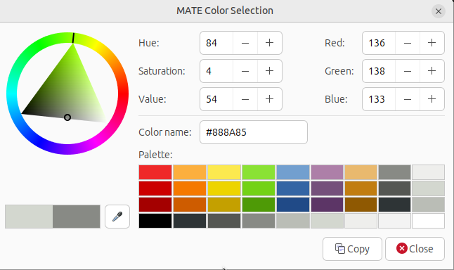

# choosing the right widget

After each game round, the player should be able to make a choice of which unused option he wants to play. See the [call reference of PySimpleGUI](https://www.pysimplegui.org/en/latest/call%20reference/#element-and-function-call-reference) for more information about each widget.

Several widgets could be used to create such an choice:

  * One _Button_ for each option
  * An _OK Button_ and additionally:
    * One _Input field_
    * _Radio Buttons_ for each option 
    * A _listbox_ 
    * A _Combo Element_
    * A _Table_

For the version 6 of dicegame, I choose the combination of a _table_ widget and a _button_. 

The _table_ widget resembles the paper version of Yatzhee with lines for each playable option and additional lines for Score, Bonus etc:

# table widget


The column _score_ shows how many points the player got for choosing a certain option, the column _possible_ shows how many points the player will get if he choose a certain option and the column _maximum_ shows the maximum score for a given option (usually by rolling a Yahtzee and choosing this option). 

If a option is already played the column _possible_ shows an empty field for this line. The same goes for lines that show sums, bonus or score. Such non-playable lines are idented by some spaces in this example.

PySimpleGUI's _table_ widget demands that the source of a table is a list of lists (or _nested list_), to represent a two-dimensional array. In fact, very similar to the PySimplegui layout.

It's a good idea to define this _nested list_ before creating the _table_ widget:

```python
score_table = [
    ["Ones",0,0,5],
    ["Twos",0,0,10],
    ["Threes",0,0,15],
    ["Fours",0,0,20],
    ["Fives",0,0,25],
    ["Sixes",0,0,30],
    ["          sum upper section",0,"",105],
    ["          upper sectoin bonus",0,"",35],
    ["Three Of A Kind",0,0,30],
    ["Four Of A Kind",0,0,30],
    ["Full House",0,0,25],
    ["Small Straight",0,0,30],
    ["Large Straight",0,0,40],
    ["Yahtzee",0,0,50],
    ["Chance",0,0,30],
    ["          sum lower section",0,"",235],
    ["          Yahtzee bonus",0,"","100 x 12"],
    ["          Score",0,"",""],
    ]
```
Please note that the header line is not defined inside this nested list. Instead, it is provided as a parameter when creating the _table widget_ inside the _layout_:

```python
layout = [
    ...
    [sg.Table(score_table, 
        headings=["option","score","possible","maximum"],
        select_mode = sg.TABLE_SELECT_MODE_BROWSE,
        cols_justification=["l","r","r","r"],
        alternating_row_color = "#888888",
        #enable_events = True,
        key="table1", 
        num_rows=18)],
    ...
]
```
For a full description of every possible parameter of the _table widget_, please look at the corresponding section in PySimpleGUI's [call reference](https://www.pysimplegui.org/en/latest/call%20reference/#table-element).

In the source code snipped above, the line with the parameter  'enable_events' are out-commented.

'enable_events' would create an _event_ if the user clicks anywhere on the table widget, like the event for a _button_ widget. This is not necessary however because the user must confirm his choice by clicking on a 'Select' button and PySimpleGUI saves the number of the selected table line in the variable _values_. 

If you try to run [dicegame6](dicegame6.py) and you get an error about the "cols_justification" parameter, you have two options:
* out-comment this line
* use the newest version of PySimpleGUI by downloading PySimpleGUI.py directly from Github and putting it into the same folder as your dicegames.

# hexadicimal color value

The parameter _'alternating_row_color'_ set' the background color of every other table line to a grey color by using a hexadecimal color value:

```python
alternating_row_color = "#888888"
```

The hexadecimal color value is a string beginning with an hastag followed by 3 hex values (from 00 to FF) representing the colors red, green and blue. If all of those 3 values are the same, the result is a grey color. If the values are high (closer to FF) the color is closer to white. If the values are low (closer to 00) the color is closer to black.

The most simple way to choose a color value is by using a "color picker" from a paint program or from your operating system:




This selected color value may conflict when choosing a grey _color theme_ for PySimpleGUI, so you must experiment yourself or out-comment the line with the _alternating_row_color_.


# improvement: Choosing option to play at the end of each game round

By providing a table widget and some changes in the event handler,  version 6 of the dicegame let the user choose an otion to play after the end of each game round. 

To simplify the code, this program  only checks if a playable option is selected, but it does not check how many points the player will get. Instead, it assumes he gets the maximum possible points. (We will correct this in version 7 of the dice game). 

After an option is played, the table widget is updated and the number in the coloumn "possible" of the played option is deleted and the number in the column "score" is updated (with the maximum score).

TODO: dicegame6.py ---> total score updaten


  


# scoring points and game rules

In the dice & paper version of Yathzee, the player simply ticks on option to play after each game round and writes the points (if he got any) in a table.

The computer version of the dice game should should make this choosing and score keeping as easy as possible. 

For each option (Full House, Fives, Chance, Three of a kind etc.) the computer version of the dice game should calculate how many points the player will get if he choose this option.

The rules of Yathzee are explained in [chapter 1](chapter_01.md), let's examine here how complex it is to translate those rules into python code:


## upper section 

There are 6 options to play in the "upper section", one option for each possible die face of a single die.

Let us assume that the result of the thrown dice is stored in `list` with the name _result_:

```python
# example
result = [1,5,5,2,4]
```

To calculate in this given example how many points the player will get if he choose to play the Fives, the answer is 'sum of all dice with this number'. In the examples, two dice show a five, meaning the player will get _5 x 2 = 10_ points.

Python provides a `.count()` methods for lists that counts how often a specific item is inside a list.

```python
# example testing for upper section
result = [1,5,5,2,4]
play = 5
how_often = result.count(play) 
# how_often has now the value 2
score = how_often * play
# score has now the value 2 x 5 = 10
```

## lower section
The scoring of the lower section is more complex. Let's start with the most simple options:

### Chance

Chance is defined as 'sum of all dice'. We can use python's `sum()` function:

```python
# example testing for chance
result = [1,2,4,4,3]
# player plays 'chance'
score = sum(result) 
# score has now value of 1+2+4+4+3=14
```

### Yathzee

Yathzee is defined as a all dice showing the same number and gives 50 points. (The Yathzee bonus is calculated in a different row).

It is possible to either test if all 5 items of _result_  have the same value or if the first item of _result_ exist 5 times inside the list:

```python
# example testing for Yathzee
result = [2,2,2,2,2]
# test for Yathzee, variant A
y = result[0] == result[1] == result[2] == result[3] == result[4]
# y has the value True
# test for Yathzee variant B
y = result.count(result[0]) == 5
# y has the value True
score = 0
if y:
    score = 50
```

### small straight and large straight

A small straight gives always 30 points, a large straight gives always 40 points.
Both straight options demand that the _result_ is sorted:

```python
result = [1,4,3,2,5]
result.sort() 
# value of result is now [1,2,3,4,5]
# example testing for small straight
small = result[:4] in ([1,2,3,4],[2,3,4,5],[3,4,5,6])
# small has now the value True
# example testing for large straight
large = result in ([1,2,3,4,5],[2,3,4,5,6])
# large has now the value True
score = 0
if large:
    score = 40
elif small:
    score = 30
```

### tree of a kind and four of a kind

Both of those options are easy to test and both give as points the sum of all dice (like Chance). 

First, python must check if any item inside _result_ has a desired count of 3 (or bigger) or 4 (or bigger)

```python
result = [1,2,3,2,2]
# example testing for three of a kind
three_of_a_kind = False
for item in result:
    if result.count(item) >= 3:
        three_of_a_kind = True
        break
# three_of_a_kind has now the value True

# example testing for four of a kind    
four_of_a_kind = False
for item in result:
    if result.count(item) >= 4:
        four_of_a_kind = True
        break
# four_of_a_kind has now still the value False
score = 0
if four_of_a_kind or three_of_a_kind:
    score = sum(result)

```

There are many other options to test if a list has 3 or more items of the same value. Search [stackoverflow](https://stackoverflow.com/) or similar websites for a huge range of solutions.


### full house

A full house gives always 25 points. It is defined as 3 equal numbers and 2 (different) equal numbers.

```python
# testing for full house
result = [1,4,1,4,4]
two_equals = False
three_equals = False
for item in result:
    if result.count(item) == 2:
        two_equals = True
    if result.count(item) == 3:
        three_equals = True
full_house = two_equals and three_equals
# full_house has now the value True
score = 0
if full_house:
    score = 25
```

## joker rules, upper bonus and yathzee bonus

See [chapter 01](chapter_01.md) for an detailed explanation about the bonus scoring. 
...


